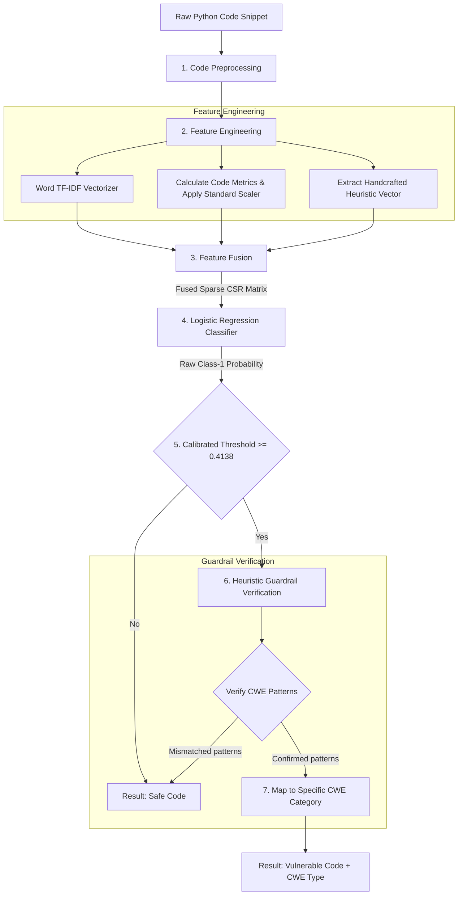

# Sentinel: AI-Powered Python Vulnerability Detection Engine

Sentinel is an experimental machine learning-powered static application security testing (SAST) tool designed to scan Python code and detect method-level vulnerabilities. It replaces synthetic classification logic with models trained on real-world security fixes from the [CVEfixes v1.0.7](https://github.com/securecodeaccess/CVEfixes) database.

---

## 🚀 Quick Start: Running the Website & Project

The Sentinel project runs a single-server architecture where the Flask application acts as the backend api and serves the frontend dashboard files directly. Follow the step-by-step instructions below to start the website.

### Step 1: Initialize Environment & Dependencies
Open your terminal (PowerShell for Windows, Bash for macOS/Linux) in the project root directory and run:

**On Windows (PowerShell):**
```powershell
# 1. Create virtual environment
python -m venv .venv

# 2. Activate virtual environment
.venv\Scripts\Activate.ps1

# 3. Install required packages
pip install -r requirements-dev.txt
```

**On macOS / Linux:**
```bash
# 1. Create virtual environment
python3 -m venv .venv

# 2. Activate virtual environment
source .venv/bin/activate

# 3. Install required packages
pip install -r requirements-dev.txt
```

---

### Step 2: Start the Web Server
Launch the Flask application to host the website and the scanner engine:

```bash
python main.py
```
*Note: Make sure your `.venv` is activated before running this command.*

---

### Step 3: Access the Website in Your Browser
Once the server starts up, open your web browser and navigate to:
👉 **[http://127.0.0.1:5000/](http://127.0.0.1:5000/)**

The application automatically exposes the following responsive TailwindCSS pages:
- 🖥️ **Home / Interactive Scanner (`index.html`)**: Paste python snippets, upload files, or type Git repositories. Served at `/` or `/login`.
- 📊 **Overview Page (`overview.html`)**: Visual summaries and breakdown charts of scans. Served at `/overview`.
- 📈 **Results Dashboard (`dashboard.html`)**: Real-time scan reports and statistics. Served at `/dashboard`.
- 📖 **Documentation Guide (`docs.html`)**: Details on the ML architecture, CWE lists, and run scripts. Served at `/docs`.

---

## 🛠️ Feature Extraction & Preprocessing Pipeline

To analyze Python code blocks effectively, Sentinel extracts a multi-modal feature set that combines statistical text models, dynamic structural metrics, and targeted security heuristics.

### 1. Code Preprocessing
Raw code is standardized using a custom normalizer:
- **Dedenting**: Dedents python blocks using the first line's indentation scale.
- **Comment Stripping**: Removes inline `#` comments.
- **Docstring Stripping**: Erases all triple-quoted docstrings (`"""..."""` and `'''...'''`).
- **Whitespace Compression**: Shrinks multiple spaces/newlines/tabs into a single whitespace.

### 2. Feature Modalities

#### A. TF-IDF Text Features
- **Vectorization**: TfidfVectorizer fit on clean code bodies.
- **N-Grams**: Extracts word-level unigrams and bigrams (`ngram_range=(1, 2)`).
- **Features Limit**: Top 5,000 statistical terms.

#### B. Code Structural Metrics
Four structural metrics are computed dynamically for every Python method and normalized via a standard scaler:
1. **NLOC (Non-Comment Lines of Code)**: The count of non-empty, non-comment lines.
2. **Cyclomatic Complexity**: Estimated based on keywords (`if`, `elif`, `for`, `while`, `except`, `with`, `and`, `or`).
3. **Token Count**: Total count of alphanumeric and special syntax tokens.
4. **Top Nesting Level**: The maximum nested depth calculated by indentation offsets.

#### C. Custom Handcrafted Security Heuristics
Boolean checks are run against the code snippet to check for common vulnerability vectors:
- **Unsafe eval/exec usage**: Detects direct invocations of `eval(` or `exec(`.
- **Command Injection**: Identifies system executions like `os.system`, `os.popen`, `subprocess.run`, `subprocess.popen`, etc.
- **SQL Injection**: Checks for SQL operations (`SELECT`, `INSERT`, `UPDATE`, `DELETE`) executed via direct calls like `.execute(` or `.executemany(`.
- **Formatted SQL String**: Checks if SQL query strings are built dynamically using f-strings (`f'`), percent formatting (`%`), or `.format(`.
- **Cross-Site Scripting (XSS)**: Flags usages of rendering functions like `render_template_string` or Markup constructs.

---

## 🔮 Inference & Prediction Workflow

Whenever a code snippet is sent to Sentinel, the prediction pipeline processes it as follows:



### Heuristic Guardrail Verification (FP Mitigation)
To prevent statistical false positives, Sentinel applies deterministic verification rules:
- A prediction of **SQL Injection** must contain both a database query and dynamic string formatting/concatenation.
- A prediction of **Command Injection** must contain actual OS system or subprocess executions.
- If these check conditions are not met, the engine overrides the ML prediction and categorizes the snippet as **Safe Code**.

---

## 📊 Trained Model Performance & Evaluation Metrics

The baseline model selected is `enhanced_word_tfidf_logistic_regression` fit with a calibrated classification probability threshold of **`0.4138`**. It has been tested against unseen repository structures to prevent code leakage.

### 1. Overall Test Metrics
Below are the results of the model evaluated against unseen test split repositories:

| Metric | Value |
| :--- | :--- |
| **Accuracy** | 48.33% |
| **Precision (Vulnerable Class)** | 49.12% |
| **Recall (Vulnerable Class)** | 92.50% |
| **F1-Score** | 0.6416 |
| **ROC-AUC** | 0.5298 |
| **PR-AUC** | 0.5307 |

#### Confusion Matrix
- **True Negatives (TN - Clean correctly predicted)**: 5
- **False Positives (FP - Clean flagged as vuln)**: 115
- **False Negatives (FN - Vuln missed)**: 9
- **True Positives (TP - Vuln correctly predicted)**: 111

*Note: In security applications, a higher recall (92.50%) is heavily prioritized over precision to avoid missing vulnerabilities (reducing False Negatives).*

---

### 2. Performance by CWE Class

| CWE Category | Total Samples | Vulnerable Samples | Recall |
| :--- | :---: | :---: | :---: |
| **CWE-21** (Path Traversal Validation) | 34 | 17 | **100.00%** |
| **CWE-79** (Cross-site Scripting - XSS) | 30 | 15 | **100.00%** |
| **CWE-200** (Information Disclosure) | 26 | 13 | **100.00%** |
| **CWE-287** (Improper Authentication) | 22 | 11 | **100.00%** |
| **CWE-1333** (Regex DoS - ReDoS) | 10 | 5 | **100.00%** |
| **CWE-22** (Path Traversal) | 10 | 5 | **100.00%** |
| **CWE-125** (Out-of-bounds Read) | 8 | 4 | **100.00%** |
| **CWE-863** (Incorrect Authorization) | 8 | 4 | **100.00%** |
| **CWE-601** (Open Redirect) | 62 | 31 | **70.97%** |
| **NVD-CWE-noinfo** (General CVEs) | 26 | 13 | **100.00%** |

---

### 3. Performance Grouped by Code Length (NLOC)

| Method Code Size | Total Samples | Vulnerable Samples | Precision | Recall | F1-Score |
| :--- | :---: | :---: | :---: | :---: | :---: |
| **Short (<10 lines)** | 108 | 55 | 50.49% | 94.55% | 0.6582 |
| **Medium (10–30 lines)** | 89 | 44 | 48.78% | 90.91% | 0.6349 |
| **Long (>30 lines)** | 43 | 21 | 46.34% | 90.48% | 0.6129 |

---

## 🔬 Running the Machine Learning Pipeline

If you want to extract the datasets and train the machine learning models from scratch, run the following pipeline scripts inside the active virtual environment:

### 1. Extract Python Methods from CVEfixes SQL Dump
Extracts raw before/after code blocks from the CVEfixes SQL database dump:
```bash
python training/extract_cvefixes.py --dump CVEfixes_v1.0.7/CVEfixes_v1.0.7/Data/CVEfixes_v1.0.7.sql.gz
```

### 2. Clean, Deconflict, and Split Dataset
Removes code duplicates, filters out invalid comments, pairs code changes, and partitions by repository:
```bash
python training/clean_data.py
```

### 3. Model Training & Calibration
Extracts features, fits standard metadata scalers, trains candidate models (Logistic Regression & Random Forest), selects the best-performing iteration, and exports model binaries to the `artifacts/` folder:
```bash
python training/train_models.py
```

### 4. Evaluate Models on Test Repositories
Runs full validation checks against unseen test sets and prints confusion matrices and performance metrics:
```bash
python training/evaluate.py
```

---

## 🧪 Running the Test Suite

Sentinel includes a comprehensive test suite powered by `pytest`. To run the unit tests, execute:

```bash
# Run all tests
pytest

# Run a specific test module
pytest tests/test_scanner.py
pytest tests/test_api.py
```

---

## 📂 Project Layout

```
├── app/
│   ├── scanner.py          # Core CodeScanner class loading model/scaler and running inference
│   └── github_scanner.py   # GitHub repository downloader (ZIP API / Git Clone) and scanner wrapper
├── training/
│   ├── extract_cvefixes.py # Extraction of python methods from CVEfixes SQL dump
│   ├── clean_data.py       # Data cleaning, pair matching, and repository-grouped splitting
│   ├── train_models.py     # Training and tuning vectorizer, scaler, and ML models
│   └── evaluate.py         # Performance evaluation on unseen test repositories
├── templates/              # Flask web UI templates
│   ├── index.html          # Main code/repo scanner page
│   ├── dashboard.html      # Scan history and statistics dashboard
│   ├── overview.html       # Visual charts and overall vulnerability distribution
│   └── docs.html           # Project overview and API documentation
├── tests/                  # Automated pytest testing suite
├── artifacts/              # Generated model binaries, scalers, and configs (git-ignored except README)
├── data/                   # Raw, interim, and processed data (git-ignored)
├── reports/                # Summary reports and metrics JSON output (git-ignored)
├── main.py                 # Flask server entrypoint
├── requirements.txt        # Production dependencies
├── requirements-dev.txt    # Development and testing dependencies
└── .env                    # Local environment config (for app-specific secrets, if any)
```
